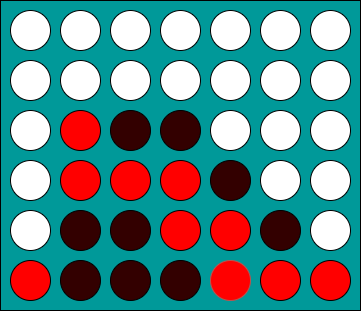

# Connect Four

Many people are familar with the game of Connect 4. It is a game that has been available since 1974 and chances are nearly everyone has played this game as a child. 

The game logic is simple: connect four of the checkers in a row or diagonally while preventing the other player from doing the same. 

## Tech stack:

* HTML5
* CSS
* JavaScript with basic DOM events

## MVP 

* Render a game area with filled with circles in 7 columns and 6 rows 
* Render the game area so that once a circle is filled, it remains that way until the game is over
* Set winning conditions and 2 colors for players 
* Create a functioning button that will reset the game without having to refreshing the window

## Stretch Goals

* Expanding winning conditions from Connect 4 to Connect 5
* Experimenting with different CSS styles or canvas to make the MVP more visually appealing to the eye 

## Potential Roadblocks
* I struggled with the TTT deliverable and, as a result, I foresee myself running into issues in regards to coding the individual circles so that they cannot be changed once they are clicked on. 
* Coding the winning conditions along with a tie game as I also had trouble with solving this issue during TTT. 
* Changing the appearance of the square once clicked on so it corresponds with the correct color 
* Alternate between 2 players' choices

## Sources/Inspiration 
* https://www.youtube.com/watch?v=aroYjgQH8Tw&t=1278s 
